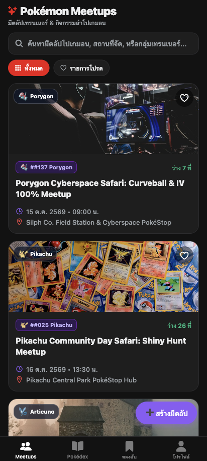
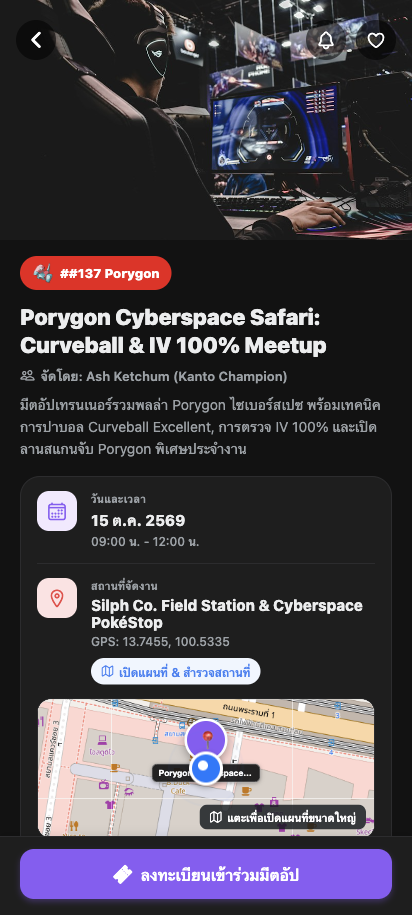
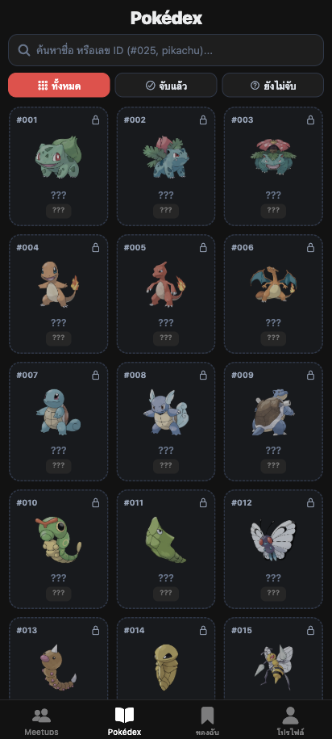
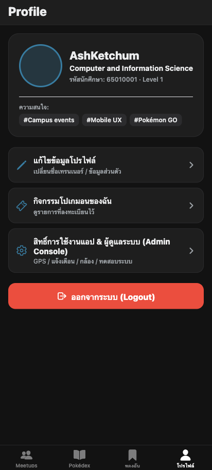
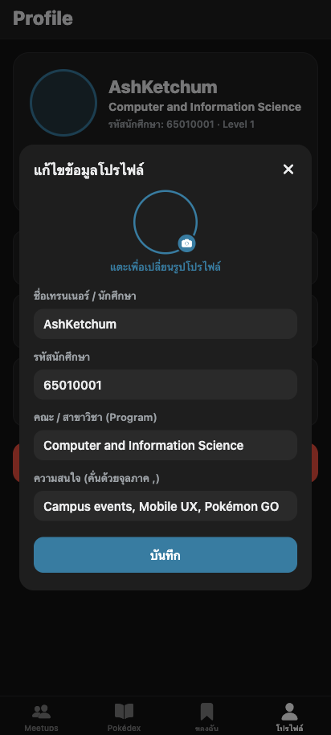
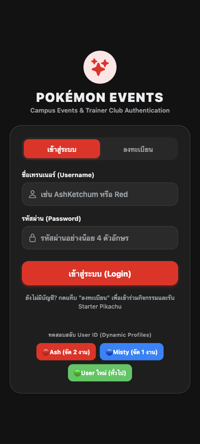
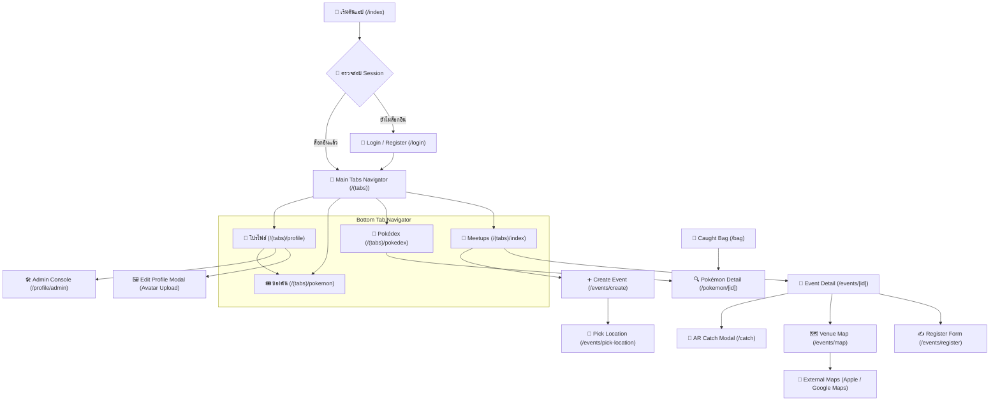

<p align="center">
  
  
  
  
  
</p>

<h1 align="center">⚡ Pokémon GO Mobile App ⚡</h1>

<p align="center">
  <b>Production-Grade Pokémon GO Simulation built with React Native & Expo SDK 57</b>
  <br />
  <i>Campus Events-First Architecture • Gen 1 Pokédex (151 Kanto Species) • AR Catch & Physics • Leaflet Venue Map & Location Picker • Offline SQLite WAL • Profile Avatar Upload</i>
</p>

<p align="center">
  <a href="https://expo.dev"></a>
  <a href="https://reactnative.dev"></a>
  <a href="https://www.typescriptlang.org"></a>
  <a href="https://docs.expo.dev/versions/latest/sdk/sqlite/"></a>
  <a href="https://pokeapi.co"></a>
  <a href="https://nodejs.org"></a>
  <a href="https://github.com/PATHAPHON/pokemongo/blob/main/LICENSE"></a>
</p>

---

## 📢 คู่มือสำคัญสำหรับอาจารย์และผู้ประเมิน (Instructor & Evaluator Quick Start)

> [!IMPORTANT]
> ### ⚠️ ข้อควรทราบในการรันแอปบน Expo Go (กด `Shift + S` เพื่อสลับโหมด)
> โปรเจกต์นี้ติดตั้งแพ็กเกจระดับ Native ขั้นสูง เช่น `expo-dev-client`, `expo-local-authentication` (Biometrics), และ `expo-secure-store`
> ส่งผลให้คำสั่งเริ่มต้น `npx expo start` จะเปิดใน **Development Build Mode** โดยอัตโนมัติ
> 
> **วิธีเปิดใช้งานผ่านแอป Expo Go บนมือถือ (iOS / Android):**
> 1. **ทางเลือกที่ 1 (แนะนำ - รันตรงสู่ Expo Go):**
>    ```bash
>    npm start
>    # หรือ: npx expo start --go
>    ```
>    คำสั่งนี้ได้ตั้งค่า flag `--go` ไว้เรียบร้อยแล้ว Metro จะสร้าง QR Code สำหรับแอป Expo Go ทันที
> 
> 2. **ทางเลือกที่ 2 (สลับโหมดใน Terminal ระหว่างรัน):**
>    หากเปิดด้วย `npx expo start` แล้วขึ้นสถานะ `Using development build` ให้กดคีย์ลัดบนคีย์บอร์ด:
>    👉 **กดปุ่ม `Shift + S` (หรือกด `s`)** ในหน้าต่าง Terminal เพื่อสลับ Bundler ไปยัง **Expo Go Mode** ทันที จากนั้นสแกน QR Code ด้วยกล้อง (iOS) หรือแอป Expo Go (Android)

### 🔑 บัญชีและทางลัดสำหรับทดสอบระบบ (Test Accounts & Shortcuts)
ในหน้าจอเข้าสู่ระบบ (`/login`) ได้จัดเตรียมปุ่ม **Quick Profile Switcher** ด้านล่างฟอร์ม เพื่อให้อาจารย์กดเข้าทดสอบระบบได้ทันทีโดยไม่ต้องพิมพ์:
- 🔴 **`Ash (จัด 2 งาน)`** (`AshKetchum` / `1234`): สิทธิ์ Organizer ดูแลกิจกรรม 2 งาน พร้อมโปเกมอนในกระเป๋า
- 🔵 **`Misty (จัด 1 งาน)`** (`MistyWaterflower` / `1234`): สิทธิ์ Organizer มีตอัปโปเกมอนน้ำ
- 🟢 **`User ใหม่ (ทั่วไป)`** (`TrainerNew` / `1234`): เทรนเนอร์ใหม่พร้อม Starter Pikachu ประจำตัว
- หรือทดสอบ **สมัครสมาชิกใหม่** ด้วยรหัสนักศึกษาและคณะได้ทันที

### ⏱️ การทดสอบ Local Notification แบบทันที (10-Second Test Loop)
เพื่อความสะดวกในการประเมินระบบแจ้งเตือน Week 11 โดยไม่ต้องรอนานถึง 30 นาที:
- เข้าหน้ารายละเอียดมีตอัป (`/events/[id]`) ใดก็ได้
- แตะปุ่ม **`⏱️ ทดสอบทุก 10 วิ`** เพื่อเปิดลูปจำลองการแจ้งเตือน
- ระบบจะส่ง Local Notification เด้งเตือนทุก 10 วินาที เมื่ออาจารย์แตะที่ Notification จะ Deep Link พามายังหน้ารายละเอียดกิจกรรมนั้นทันที (ทดสอบ Cold Start & Tap Listener ได้สมบูรณ์)

### 🧪 คำสั่งรันชุดทดสอบอัตโนมัติ (Automated Tests)
โปรเจกต์มีชุดทดสอบครอบคลุมหลักสูตร 11 สัปดาห์ครบถ้วน รันผ่าน Node.js Test Runner:
```bash
# รันชุดทดสอบทั้งหมด 234 ข้อ (63 Test Suites)
npm test

# ตรวจสอบ TypeScript Type Safety (0 Errors)
npx tsc --noEmit
```

---

## 📸 ภาพตัวอย่างหน้าจอการทำงานจริง (Application Previews)

<table align="center">
  <tr>
    <td align="center" width="33%">
      <b>1. ค้นหามีตอัป (Meetups Home)</b><br/><br/>
      <br/>
      <sub>ค้นหาเรียลไทม์, กรองทั้งหมด/รายการโปรด, โควตาที่นั่ง</sub>
    </td>
    <td align="center" width="33%">
      <b>2. รายละเอียด & จับโปเกมอน (Event Detail)</b><br/><br/>
      <br/>
      <sub>Mini Map หมุดสถานที่, ปุ่มจับทันที ⚡, ลูปทดสอบ 10 วิ</sub>
    </td>
    <td align="center" width="33%">
      <b>3. สารานุกรม (Pokédex Gen 1)</b><br/><br/>
      <br/>
      <sub>สารานุกรม 151 ตัวแรก, กรองสถานะ จับแล้ว/ยังไม่จับ</sub>
    </td>
  </tr>
  <tr>
    <td align="center" width="33%">
      <b>4. โปรไฟล์เทรนเนอร์ (Trainer Profile)</b><br/><br/>
      <br/>
      <sub>ข้อมูลนักศึกษา, ระดับเลเวล, เมนูแก้ไข & Admin</sub>
    </td>
    <td align="center" width="33%">
      <b>5. อัปโหลดรูปโปรไฟล์ (Avatar Upload)</b><br/><br/>
      <br/>
      <sub>เลือกรูปจากกล้อง/คลังภาพ, ครอป 1:1, Draft Save</sub>
    </td>
    <td align="center" width="33%">
      <b>6. เข้าสู่ระบบ (Auth & Biometrics)</b><br/><br/>
      <br/>
      <sub>SecureStore Token, Quick Switchers, ชีวมาตร</sub>
    </td>
  </tr>
</table>

---

## 📊 ตารางสรุปการส่งงานตามเกณฑ์ 11 สัปดาห์ (11-Week Syllabus Compliance)

| สัปดาห์ | หัวข้อหลักสูตรโมบายล์ | สถานะ | จำนวน Tasks | ฟีเจอร์เด่นในโปรเจกต์ |
| :---: | :--- | :---: | :---: | :--- |
| **W1** | Mobile Development, React Native & Expo | 100% ✅ | 4/4 | TypeScript strict, `@/*` alias, Core Components, StudentProfile |
| **W2** | Components, Props, State และ Events | 100% ✅ | 5/5 | Reusable EventCard, Props interfaces, State toggles, Accessibility Labels |
| **W3** | Styling และ Responsive Mobile UI | 100% ✅ | 4/4 | Responsive Layout (มือถือ/แท็บเล็ต), FlatList virtualization, Error/Retry state |
| **W4** | Expo Router และ File-Based Navigation | 100% ✅ | 5/5 | Root Stack, Bottom Tabs `(tabs)`, Dynamic route `/events/[id]`, Scheme URI |
| **W5** | Forms และ Controlled State Management | 100% ✅ | 5/5 | Controlled Form, Email Regex, KeyboardAvoidingView, Favorite Reducer |
| **W6** | REST API และ Networking | 100% ✅ | 4/4 | PokéAPI v2 client, Pull-to-refresh, AbortController timeout, Network retry |
| **W7** | Local Storage และ Offline Persistence | 100% ✅ | 5/5 | SQLite WAL Mode, Stale-While-Revalidate, Mutex queue, Offline badges |
| **W8** | Authentication และ Mobile Security | 100% ✅ | 5/5 | SecureStore hardware keychain, Token TTL 7 วัน, Biometrics (Face/Touch ID) |
| **W9** | Camera, Image Picker และ Permissions | 100% ✅ | 4/4 | `expo-camera`, `expo-image-picker`, On-demand permissions, Avatar upload 1:1 |
| **W10** | Location และ Maps Integration | 100% ✅ | 5/5 | Leaflet OSM Map, Location Picker (`/events/pick-location`), Inline Mini Map, Distance engine |
| **W11** | Notifications และ Mobile Platform APIs | 100% ✅ | 5/5 | Android Channel `event-reminders`, Scheduled reminders 30 นาที, 10s Test Loop, Cold start guard |
| **รวม** | **ครบถ้วน 11 สัปดาห์** | **100% ✅** | **46/46 Tasks** | **234 Automated Tests Passed (63 Suites)** |

---

## ✨ ไฮไลต์ฟีเจอร์เด่น (Key Features)

<table>
  <tr>
    <td width="50%" valign="top">
      <h3 align="center">📅 Campus Meetups & Events Loop</h3>
      <p align="center">
        <br/>
        ค้นหากิจกรรมมีตอัปโปเกมอนในมหาวิทยาลัยแบบเรียลไทม์ กรองรายการทั้งหมดหรือรายการโปรด (Favorites), แสดงแถบโควตาความจุผู้เข้าร่วม (Seats Remaining), ลงทะเบียนพร้อมแนบรูปถ่ายหลักฐาน และบันทึกข้อมูลออฟไลน์ลง SQLite
      </p>
    </td>
    <td width="50%" valign="top">
      <h3 align="center">🗺️ Event Venue Map & Location Picker</h3>
      <p align="center">
        <br/>
        แผนที่สถานที่จัดงาน 2D Leaflet OSM พร้อม <b>Inline Mini Map Preview (140px)</b> ในหน้ารายละเอียด, หน้าแผนที่เต็มจอ (<code>/events/map</code>) พร้อมปุ่มซูมกลับและเปิดนำทางสู่ Apple Maps / Google Maps รวมถึง <b>Location Picker (<code>/events/pick-location</code>)</b> สำหรับผู้จัดในการปักหมุดพิกัด GPS อัตโนมัติ
      </p>
    </td>
  </tr>
  <tr>
    <td width="50%" valign="top">
      <h3 align="center">📸 AR Catch Mode & Ball Physics</h3>
      <p align="center">
        <br/>
        โหมดจับโปเกมอนด้วยกล้องจริงผ่าน <code>expo-camera</code> หรือสลับเป็น Classic Meadow Field ทุ่งหญ้าคลาสสิก พร้อมฟิสิกส์ขว้างบอล Gesture-driven (PanResponder), วงแหวนจับ (Nice / Great / Excellent), ระบบสั่น Haptic Feedback และ<b>กฎ Single-Catch</b> ล็อกสิทธิ์จับ 1 ครั้งต่อผู้ลงทะเบียน
      </p>
    </td>
    <td width="50%" valign="top">
      <h3 align="center">📖 Gen 1 Pokédex Catalog (151 สายพันธุ์ Kanto)</h3>
      <p align="center">
        <br/>
        แท็บสารานุกรม <b>Pokédex 151 ตัวแรกแห่งภูมิภาคคันโต (Kanto Gen 1: #001 Bulbasaur ถึง #151 Mew)</b> พร้อมตัวกรองสถานะ (ทั้งหมด / จับแล้ว / ยังไม่จับ) และระบบค้นหาเรียลไทม์ตามชื่อหรือเลข #ID แสดงภาพ Official Artwork, สถิติส่วนสูง, น้ำหนัก และคำอธิบายจาก PokéAPI
      </p>
    </td>
  </tr>
  <tr>
    <td width="50%" valign="top">
      <h3 align="center">🎒 Trainer Bag & Pokémon Storage</h3>
      <p align="center">
        <br/>
        กระเป๋าโปเกมอนที่จับได้ (<code>/bag</code>) แสดงสถิติจำนวนที่ครอบครอง, กรองตามระดับความหายาก (All / Common / Rare / Ultra Rare), แสดงการ์ดโปเกมอนพร้อม Official Artwork และธาตุ, ปล่อยสู่ธรรมชาติ (Transfer / Release) พร้อมกล่องยืนยัน และแตะดูรายละเอียดโปเกมอน
      </p>
    </td>
    <td width="50%" valign="top">
      <h3 align="center">💾 Offline-First SQLite (WAL Mode)</h3>
      <p align="center">
        <br/>
        บันทึกข้อมูลถาวรในเครื่องผ่าน <code>expo-sqlite</code> โครงสร้าง OOP Repositories: <code>EventRepository</code>, <code>PokemonRepository</code>, <code>TrainerRepository</code> ทำงานออฟไลน์ได้ 100% พร้อมกลไก Stale-While-Revalidate และ Mutex Queue แยกสิทธิ์ตามผู้ใช้
      </p>
    </td>
  </tr>
</table>

---

## 📱 โครงสร้างหน้าจอและเนวิเกชัน (Navigation Architecture)

ระบบเนวิเกชันสร้างด้วย **Expo Router (File-based Routing)** แบ่งเป็น Authentication Guard, 4 แท็บหลัก และ Stack Screens:



---

## 🏗️ โครงสร้างไฟล์ในโปรเจกต์ (Project Directory Tree)

```bash
pokemongo/
├── src/
│   ├── app/                               # File-based Routes (Expo Router)
│   │   ├── index.tsx                      # 🚀 Root Session Guard & Redirect
│   │   ├── +not-found.tsx                 # 🚫 404 Route Fallback
│   │   ├── login.tsx                      # 🔐 Trainer Auth, Biometrics & Switcher
│   │   ├── bag.tsx                        # 🎒 Caught Pokémon Bag (Stack Screen)
│   │   ├── catch.tsx                      # 🎯 AR Camera & Physics Encounter Modal
│   │   ├── (tabs)/                        # 4 Bottom Tabs
│   │   │   ├── index.tsx                  # 📅 Tab 1: Meetups Discovery
│   │   │   ├── pokedex.tsx                # 📖 Tab 2: Gen 1 Pokédex Catalog (151)
│   │   │   ├── pokemon.tsx                # 🎟️ Tab 3: ของฉัน (Registered, Favs, Hosting)
│   │   │   ├── profile.tsx                # 👤 Tab 4: Trainer Profile & Menu
│   │   │   └── _layout.tsx                # Tab Shell, Icons & HapticTab
│   │   ├── events/
│   │   │   ├── [id].tsx                   # 📄 Event Detail, Mini Map & Direct Catch
│   │   │   ├── register.tsx               # ✍️ Registration Form & Photo Proof
│   │   │   ├── create.tsx                 # ➕ Organizer Event Creation Form
│   │   │   ├── map.tsx                    # 🗺️ Leaflet Venue Map & Navigation
│   │   │   └── pick-location.tsx          # 📍 Interactive Location Pin Picker
│   │   ├── pokemon/[id].tsx               # 🔍 Pokémon Specs & Official Artwork
│   │   ├── profile/admin.tsx              # 🛠️ Admin Diagnostics & Permissions Console
│   │   └── _layout.tsx                    # Root Layout, Auth Guards & Notification Stack
│   │
│   ├── features/                          # Domain Lego-Block Modules
│   │   ├── events/                        # Campus Events System
│   │   │   ├── components/                # EventCard, Pickers (Date, Time, Pokemon), Mini Map
│   │   │   └── hooks/                     # useEvents, useEventDetail, useEventActions
│   │   ├── catch/                         # Dual-Mode Catch Arena (Camera Gate & Ball Physics)
│   │   ├── map/                           # 2D Venue Map Engine (Leaflet OSM & Pin Layer)
│   │   ├── pokedex/                       # Pokédex Grid, Filters & Catalog Hooks
│   │   ├── pokemon/                       # Caught Pokemon Storage, Rarity Filter & Specs
│   │   └── profile/                       # Trainer Profile, Avatar Upload Modal & Admin
│   │
│   └── shared/                            # Global Foundation & Infrastructure
│       ├── components/                    # TypeBadge, RarityBadge, HapticTab
│       ├── constants/                     # Theme, 18 Elemental Types, Pokémon Registry (151), Events
│       ├── context/                       # TrainerContext & EventContext Providers
│       ├── services/                      # Repositories & Singleton Services
│       │   ├── database/                  # DatabaseManager, Event/Pokemon/Trainer Repositories
│       │   ├── events/                    # EventService (Runtime & SQLite Sync)
│       │   ├── notifications/             # NotificationManager, Channels & Scheduler
│       │   ├── pokeapi/                   # PokeApiClient & Cache Layer
│       │   └── auth-api.ts                # Session Management, Keychain & Biometrics
│       ├── utils/                         # Route Constants, Location Store & Thai Date/Time Helpers
│       └── types/                         # Shared TypeScript Models
│
├── docs/                                  # Documentation & Artifacts
│   ├── screenshots/                       # 📸 High-Resolution Screen Previews
│   ├── adr/                               # Architecture Decision Records (ADR 001 - 007)
│   └── syllabus-presentation.html         # 11-Week Syllabus Slide Deck
├── tests/                                 # Automated Test Suites (234 Tests Passed across 63 Suites)
├── plan.md                                # Roadmap & Implementation Tracker
└── task.md                                # 11-Week Task Breakdown (46/46 Tasks 100%)
```

---

## 🚀 เริ่มต้นใช้งานโปรเจกต์ (Getting Started)

### 1. ความต้องการของระบบ (Prerequisites)
- **Node.js**: เวอร์ชัน `>= 18.x` (แนะนำ Node 20 หรือ 22 LTS)
- **npm**: เวอร์ชัน `>= 9.x`
- **Expo Go App** บนมือถือ หรือ **iOS Simulator / Android Emulator**

### 2. ติดตั้ง Dependencies
```bash
git clone https://github.com/PATHAPHON/pokemongo.git
cd pokemongo
npm install
```
*(ระบบจะรัน `postinstall` script เพื่อ patch native compatibility สำหรับ mock drivers อัตโนมัติ)*

### 3. รันโปรเจกต์ (Development Mode)
```bash
# รันสำหรับ Expo Go บนมือถือ (สร้าง QR Code อัตโนมัติ)
npm start

# หรือหากใช้ npx expo start แล้วต้องการสลับเป็น Expo Go:
# ให้กดปุ่ม "Shift + S" ในหน้าต่าง Terminal

# รันตรงไปยัง iOS Simulator
npm run ios

# รันตรงไปยัง Android Emulator
npm run android

# รันบน Web Browser
npx expo start --web
```

---

## 📄 บันทึกการตัดสินใจทางสถาปัตยกรรม (ADR Index)

- [ADR-001: Navigation Architecture & Tab Shell](docs/adr/0001-navigation-expo-router.md)
- [ADR-002: PokéAPI Integration & Official Artwork Caching](docs/adr/0002-data-fetching-pokeapi.md)
- [ADR-003: Offline Storage & SQLite WAL Persistence](docs/adr/0003-offline-storage-persistence.md)
- [ADR-004: Camera AR & Dual-Mode Fallback](docs/adr/0004-camera-ar-fallback.md)
- [ADR-005: Location & Spawn Simulation Engine](docs/adr/0005-location-and-spawn-simulation.md)
- [ADR-006: Haptics Feedback & Local Notifications](docs/adr/0006-haptics-and-notifications.md)
- [ADR-007: Campus Events Unification & Single-Catch Mechanics](docs/adr/0007-campus-events-unification.md)

---

## 👨‍💻 ผู้พัฒนา (Author)

- **PATHAPHON** — [GitHub Profile](https://github.com/PATHAPHON)
- Repository: [PATHAPHON/pokemongo](https://github.com/PATHAPHON/pokemongo)

<p align="center">
  <sub>Gotta Catch 'Em All! • สร้างสรรค์ด้วยความหลงใหลในโลกโปเกมอนและโมบายล์เทคโนโลยี</sub>
</p>
