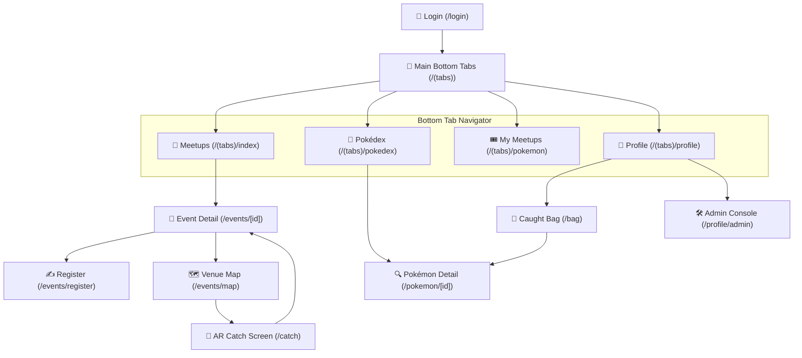

<p align="center">
  
  
  
  
  
</p>

<h1 align="center">⚡ Pokémon GO Mobile App ⚡</h1>

<p align="center">
  <b>Production-Grade Pokémon GO Simulation built with React Native & Expo SDK 57</b>
  <br />
  <i>Campus Events-First Architecture • Gen 1-3 Pokédex (386 Species) • AR Catch & Physics • Leaflet Venue Map • Offline SQLite WAL</i>
</p>

<p align="center">
  <a href="https://expo.dev"></a>
  <a href="https://reactnative.dev"></a>
  <a href="https://www.typescriptlang.org"></a>
  <a href="https://docs.expo.dev/versions/latest/sdk/sqlite/"></a>
  <a href="https://pokeapi.co"></a>
  <a href="https://github.com/PATHAPHON/pokemongo/blob/main/LICENSE"></a>
</p>

---

## 🌟 ภาพรวมโปรเจกต์ (Overview)

แอปพลิเคชันมือถือจำลองเกมระดับโลก **Pokémon GO** ที่พัฒนาขึ้นบน **React Native (Expo SDK 57)** ตามหลักสูตรโมบายล์ 11 สัปดาห์ ครบถ้วน 35 Micro-Tasks (100% Complete) ขับเคลื่อนด้วยสถาปัตยกรรม **Campus Events-First Architecture** ที่รวมการจัดกิจกรรมพบปะ (Campus Meetups) เข้ากับเกมเพลย์การสำรวจและจับโปเกมอนอย่างลงตัว

โค้ดทั้งหมดออกแบบตามแนวทาง **Lego-Block Architecture & Domain-Driven Repositories** แยกชั้นข้อมูล Business Logic, Presentation Layer, และ Persistent Storage ออกจากกันอย่างเด็ดขาด ปราศจาก Dead Code และผ่านการตรวจสอบ TypeScript Typecheck 100% พร้อมชุดทดสอบอัตโนมัติครบ 67 ข้อ

> 💡 **Simulator & Hardware Fallback Ready:** ใช้งานได้เต็มประสิทธิภาพทั้งบน **iOS Simulator**, **Android Emulator**, **Web Browser**, และอุปกรณ์จริง พร้อมระบบกล้อง AR Fallback (ทุ่งหญ้าคลาสสิก), GPS Simulated Coordinates, และ Safe Notification Drivers

---

## ✨ ไฮไลต์ฟีเจอร์เด่น (Key Features)

<table>
  <tr>
    <td width="50%" valign="top">
      <h3 align="center">📅 Campus Meetups & Events Loop</h3>
      <p align="center">
        <br/>
        ค้นหากิจกรรมมีตอัปโปเกมอนในมหาวิทยาลัย กรองหมวดหมู่ (เวิร์กช็อป, วิจัย, กีฬา, สังสรรค์), ตรวจสอบจำนวนผู้เข้าร่วม, ลงทะเบียนพร้อมบันทึกบัตรคิว และจัดการสถานะแบบออฟไลน์
      </p>
    </td>
    <td width="50%" valign="top">
      <h3 align="center">🗺️ Event Venue Map & Spawn Engine</h3>
      <p align="center">
        <br/>
        แผนที่สถานที่จัดงาน 2D Leaflet OSM ประจำอีเวนต์ พร้อมกลไก <b>Scan-to-Spawn</b> โปเกมอนประจำงาน (Featured Pokémon), แถบนับถอยหลังอายุสปอว์น 10 นาทีแบบเรียลไทม์ และกฎสิทธิ์จับ 1 ครั้งต่อผู้เข้าร่วม (Single-Catch Rule)
      </p>
    </td>
  </tr>
  <tr>
    <td width="50%" valign="top">
      <h3 align="center">📸 AR Catch Mode & Ball Physics</h3>
      <p align="center">
        <br/>
        โหมดจับโปเกมอนด้วยกล้องจริงผ่าน <code>expo-camera</code> หรือสลับเป็น Classic Meadow Field ทุ่งหญ้าคลาสสิก พร้อมฟิสิกส์ขว้างบอล Gesture-driven, วงแหวนจับ (Nice / Great / Excellent), ระบบสั่น Haptic Feedback และระบบกันจับซ้ำ
      </p>
    </td>
    <td width="50%" valign="top">
      <h3 align="center">📖 Gen 1-3 Pokédex Catalog (386 ตัว)</h3>
      <p align="center">
        <br/>
        สารานุกรมโปเกมอนครบถ้วน 3 เจนเนอเรชัน (Kanto, Johto, Hoenn) รวม 386 สายพันธุ์ แสดงภาพ Official Artwork, สถิติ Base Stats, ส่วนสูง, น้ำหนัก, กรองตามเจนเนอเรชัน ธาตุทั้ง 18 ธาตุ และค้นหาแบบเรียลไทม์
      </p>
    </td>
  </tr>
  <tr>
    <td width="50%" valign="top">
      <h3 align="center">🎒 Trainer Bag & Pokémon Storage</h3>
      <p align="center">
        <br/>
        กระเป๋าโปเกมอนที่จับได้ จัดการเปลี่ยนชื่อเล่น (Nickname), ติดดาวรายการโปรด, ปล่อยสู่ธรรมชาติ (Transfer), กรองตามระดับความหายาก (Common / Rare / Legendary) พร้อมคลังไอเทมบอลและเบอร์รี่
      </p>
    </td>
    <td width="50%" valign="top">
      <h3 align="center">💾 Offline-First SQLite (WAL Mode)</h3>
      <p align="center">
        <br/>
        บันทึกข้อมูลถาวรในเครื่องผ่าน <code>expo-sqlite</code> โครงสร้าง OOP Repositories: <code>EventRepository</code>, <code>PokemonRepository</code>, <code>TrainerRepository</code>, <code>InventoryRepository</code> ทำงานออฟไลน์ได้ 100%
      </p>
    </td>
  </tr>
</table>

---

## 📱 โครงสร้างหน้าจอและเนวิเกชัน (Screen Navigation Architecture)

ระบบเนวิเกชันสร้างด้วย **Expo Router (File-based Routing)** แบ่งเป็น 4 แท็บหลักและ Stack Screens:



---

## 🏗️ โครงสร้างโปรเจกต์ (Lego-Block Codebase Tree)

```bash
pokemongo/
├── src/
│   ├── app/                               # File-based Routes (Expo Router)
│   │   ├── (tabs)/                        # 4 Bottom Tabs
│   │   │   ├── index.tsx                  # 📅 Tab 1: Meetups Discovery
│   │   │   ├── pokedex.tsx                # 📖 Tab 2: Gen 1-3 Pokédex Catalog
│   │   │   ├── pokemon.tsx                # 🎟️ Tab 3: My Meetups (Registered/Favorites)
│   │   │   ├── profile.tsx                # 👤 Tab 4: Trainer Profile & Settings
│   │   │   └── _layout.tsx                # Tab Shell, Icon Setup & Haptic Tab
│   │   ├── bag.tsx                        # 🎒 Caught Pokémon Bag (Stack, from Profile)
│   │   ├── events/
│   │   │   ├── [id].tsx                   # 📄 Event Detail & Catch Banner
│   │   │   ├── register.tsx               # ✍️ Registration Form & Ticket Confirmation
│   │   │   ├── create.tsx                 # ➕ Organizer Event Creation
│   │   │   └── map.tsx                    # 🗺️ Leaflet Venue Map & Scan-to-Spawn
│   │   ├── pokemon/[id].tsx               # 🔍 Pokémon Specs & Official Artwork
│   │   ├── catch.tsx                      # 🎯 AR Camera & Physics Encounter Modal
│   │   ├── profile/admin.tsx              # 🛠️ Admin Console & Diagnostics
│   │   ├── login.tsx                      # 🔐 Trainer Auth & Session Switch
│   │   └── _layout.tsx                    # Root Layout, Providers & Route Guarding
│   │
│   ├── features/                          # Lego-Block Modules
│   │   ├── events/                        # Campus Events System
│   │   │   ├── components/                # EventCard, FilterBar, DetailHero, StatsHeader
│   │   │   ├── hooks/                     # useEvents, useEventDetail, useEventActions
│   │   │   └── types.ts                   # Category, Filter, Stats Types
│   │   ├── catch/                         # Dual-mode Catch Arena
│   │   │   ├── components/                # CameraPermissionGate, PokeballArena, GotchaModal
│   │   │   └── hooks/use-catch-game.ts    # Throw Mechanics & Grading Physics
│   │   ├── map/                           # 2D Venue Map Engine
│   │   │   ├── components/                # LeafletMapView (Dynamic 600s bar, Web & Native)
│   │   │   ├── hooks/use-event-venue-pins.ts
│   │   │   └── services/spawn-engine.ts   # Venue Spawning & Distance Calculations
│   │   ├── pokedex/                       # Pokédex Components & Hooks
│   │   ├── pokemon/                       # Caught Pokemon Cards & Specs
│   │   └── profile/                       # Trainer Profile, Edit Modal & Admin Console
│   │
│   └── shared/                            # Global Foundation & Infrastructure
│       ├── components/                    # TypeBadge, RarityBadge, HapticTab
│       ├── constants/                     # Theme, 18 Types, Registry (386), Campus Events
│       ├── context/                       # TrainerContext & EventContext Providers
│       ├── services/                      # OOP Repositories & Singleton Services
│       │   ├── database/                  # DatabaseManager, Event/Pokemon/Trainer Repositories
│       │   ├── events/                    # EventService (Runtime & SQLite Sync)
│       │   ├── notifications/             # NotificationManager & Channels
│       │   ├── pokeapi/                   # PokeApiClient & Cache Layer
│       │   └── auth-api.ts                # Session Management & Storage
│       ├── utils/                         # Route Constants & Event Helpers
│       └── types/                         # Shared TypeScript Models
│
├── tests/                                 # Automated Test Suites (Node.js / tsx runner)
│   ├── campus-events.test.mjs             # Meetup Data, Capacity & Catch Attempt Tests
│   ├── pokemon-test-suite.test.mjs        # Core Domain, Repositories & Rarity Tests
│   ├── pokedex.test.mjs                   # 386 Pokémon Registry, Stats & Gen Boundary Tests
│   ├── gen2-gen3-unique-spawns.test.mjs   # Non-Duplicate Spawning Verification
│   ├── spawn-notifications-rarity.test.mjs# Spawn Evaluation & Alert Contracts
│   ├── week6-networking.test.mjs         # PokéAPI REST API & Networking Tests
│   ├── week8-auth-session.test.mjs        # Auth, Token & Mobile Security Tests
│   ├── week11-notifications.test.mjs      # Notification Channels & Triggers
│   └── web-platform-guard.test.mjs        # Cross-Platform Fallbacks Tests
│
├── docs/                                  # Architectural Documentation
│   ├── adr/                               # Architecture Decision Records (ADR 001 - 007)
│   └── syllabus-presentation.html         # 11-Week Syllabus Slide Deck
├── plan.md                                # Development Roadmap & Phase Plans
└── task.md                                # Micro-Task Progress Tracker
```

---

## 🎨 ระบบธาตุทั้ง 18 ธาตุ (18 Elemental Types)

<p align="center">
  
  
  
  
  
  
  
  
  
  
  
  
  
  
  
  
  
  
</p>

---

## 🧪 การทดสอบระบบ (Automated Testing & Quality Assurance)

โปรเจกต์มีชุดทดสอบอัตโนมัติ **67 รายการ (24 Test Suites)** รันผ่านรวดเร็วระดับมิลลิวินาที:

```bash
# ตรวจสอบ TypeScript ทั้งหมด (0 Type Errors)
npx tsc --noEmit

# รันชุดทดสอบทั้งหมด
npm test

# หรือรันผ่าน tsx โดยตรง
npx tsx --test tests/**/*.test.mjs

# ตรวจสอบและจัดระเบียบโค้ด
npm run format:check
npm run format
```

---

## 🚀 เริ่มต้นใช้งานโปรเจกต์ (Getting Started)

### 1. ความต้องการของระบบ (Prerequisites)
- **Node.js**: เวอร์ชัน `>= 18.x` (แนะนำ Node 20 หรือ 22 LTS)
- **npm**: เวอร์ชัน `>= 9.x`
- **Expo Go App** (บน iOS / Android) หรือ **Simulator / Emulator**

### 2. ติดตั้งโปรเจกต์
```bash
git clone https://github.com/PATHAPHON/pokemongo.git
cd pokemongo
npm install
```

### 3. รันโปรเจกต์ใน Development Mode
```bash
# รัน Metro Bundler ปกติ
npm start

# รันตรงไปยัง iOS Simulator
npm run ios

# รันตรงไปยัง Android Emulator
npm run android

# รันบน Web Browser
npx expo start --web
```

---

## 📄 บันทึกการตัดสินใจทางสถาปัตยกรรม (ADR Index)

- [ADR-001: Navigation Architecture & Tab Shell](docs/adr/0001-navigation-expo-router.md)
- [ADR-002: PokéAPI Integration & Official Artwork Caching](docs/adr/0002-data-fetching-pokeapi.md)
- [ADR-003: Offline Storage & SQLite WAL Persistence](docs/adr/0003-offline-storage-persistence.md)
- [ADR-004: Camera AR & Dual-Mode Fallback](docs/adr/0004-camera-ar-fallback.md)
- [ADR-005: Location & Spawn Simulation Engine](docs/adr/0005-location-and-spawn-simulation.md)
- [ADR-006: Haptics Feedback & Local Notifications](docs/adr/0006-haptics-and-notifications.md)
- [ADR-007: Campus Events Unification & Single-Catch Mechanics](docs/adr/0007-campus-events-unification.md)

---

## 👨‍💻 ผู้พัฒนา (Author)

- **PATHAPHON** — [GitHub Profile](https://github.com/PATHAPHON)
- Repository: [PATHAPHON/pokemongo](https://github.com/PATHAPHON/pokemongo)

<p align="center">
  <sub>Gotta Catch 'Em All! • สร้างสรรค์ด้วยความหลงใหลในโลกโปเกมอนและโมบายล์เทคโนโลยี</sub>
</p>
